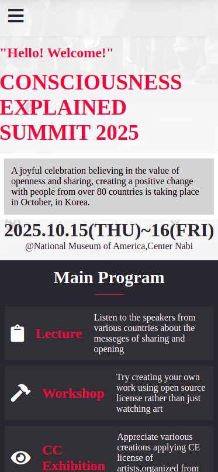

# Portfolio

> Building a Captone-project to review the things learned so as to show an understanding of all things learned.




## Live link
[Click here to see project](https://tchilo.github.io/the-portal-capstone/)

Additional description about the project and its features.

## Built With

- Major languages
- HTML
- JavaScript
- CSS


## Getting Started

**To get a copy of this repo into your local machine run the following command:**
```
git clone https://github.com/Tchilo/the-portal-capstone 
cd the-portal-capstone
in visual studio code you can click the go live button to view it live in the browser.
```

## Author

👤 **Taro Chilongoshi**

- GitHub: [@Tchilo](https://github.com/Tchilo)


## 🤝 Contributing

Contributions, issues, and feature requests are welcome!
Feel free to check the [issues page](../../issues/).

## Show your support

Give a ⭐️ if you like this project!

## Acknowledgments
- Original design idea by
[Cindy Shin in Behance](https://www.behance.net/adagio07)

## 📝 License

This project is [MIT](./MIT.md) licensed.
